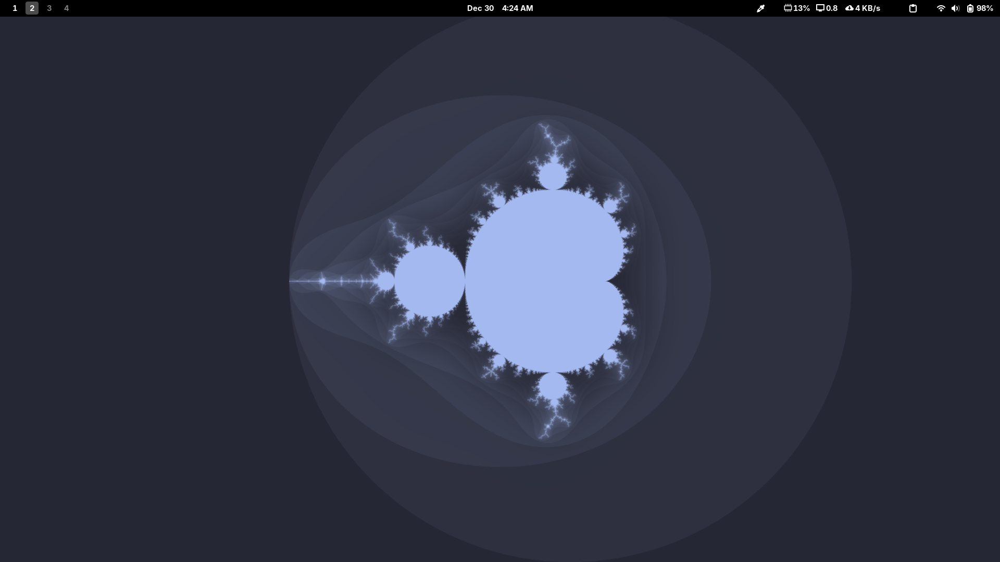
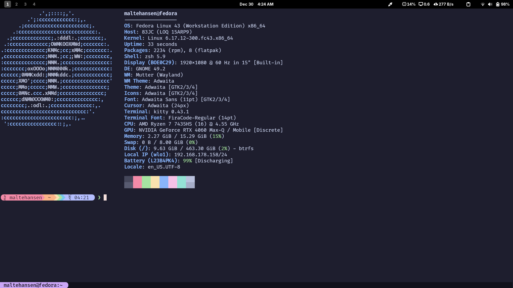

# 🚀 Fedora Post-Installation Script

An (almost) **fully-automated** Fedora post-installation script that configures **system settings**, installs **drivers and software**, and applies **GNOME & terminal tweaks**.
This project focuses on a clean, opinionated Fedora setup without becoming overly bloated.

---

## 📚 Table of Contents

- [**🛠️ Requirements**](#%EF%B8%8F-requirements)
- [**💻 Installation Instructions**](#-installation-instructions)
- [**🧠 After Installation**](#-after-installation)
- [**✨ Features Overview**](#-features-overview)

---

## Screenshot after using the installation script:




---

## 🛠️ Requirements
### ⚙️ System

- **Fedora Workstation (with GNOME Desktop Environment!)**
- **Sudo access**
- **Assumes /home/username layout**
- **Time properly set up**

---

## 💻 Installation Instructions
Open your terminal and run:
````
git clone https://github.com/MalteHansenOfficial/fedora-post-installation
cd fedora-post-installation
chmod +x install.sh
sudo ./install.sh
````

**⚠️ Do NOT run this script via su.**
**⚠️ During execution, the script will interactively ask which GPU drivers to install.**

---

## 🧠 After Installation
- **Wait ~5 minutes for the kernel modules to be built if you installed graphics drivers.**
- **Reboot required!**

### Optionally:
- **Install my clean, modular [Neovim Config](https://github.com/MalteHansenOfficial/.config)**
- **Install [Space Bar](https://extensions.gnome.org/extension/5090/space-bar/)**
- **Install [Clipboard Indicator](https://extensions.gnome.org/extension/779/clipboard-indicator/)**
- **Install [Color Picker](https://extensions.gnome.org/extension/3396/color-picker/)**
- **Install [Vitals](https://extensions.gnome.org/extension/1460/vitals/)**

---

## ✨ Features Overview
### 🧑‍💻 System Configuration

- **Disable automatic suspend (AC & battery)**
- **Disable NetworkManager-wait-online for faster boot**
- **Enable faster DNF downloads (max_parallel_downloads=10)**

### 📦 Software & Repositories

- **Enable RPM Fusion (free & nonfree)**
- **Install RPM packages from dnf.txt**
- **Install Flatpak apps from flatpak.txt**
- **Automatic update of all packages (dnf and flatpak) and firmware**

### 🖥️ Terminal & Shell Setup
- **Install kitty with custom configuration**
- **Install Oh My Zsh**
- **Install Starship prompt via COPR**
- **Apply Catppuccin Powerline preset**
- **Add Kitty to autostart**

### ⌨️ GNOME Tweaks & Keybindings
- **Ctrl + Alt + T to open Kitty**
- **Ctrl + Alt + B to open chromium**
- **Workspace Shortcuts (e.g. Super + 3 to move to workspace 3, Super + Shift + 3 to move a window to workspace 3)**

### 🖼️ Appearance
- **Use GNOME Dark Mode**
- **Apply Catppuccin Mandelbrot wallpaper**
